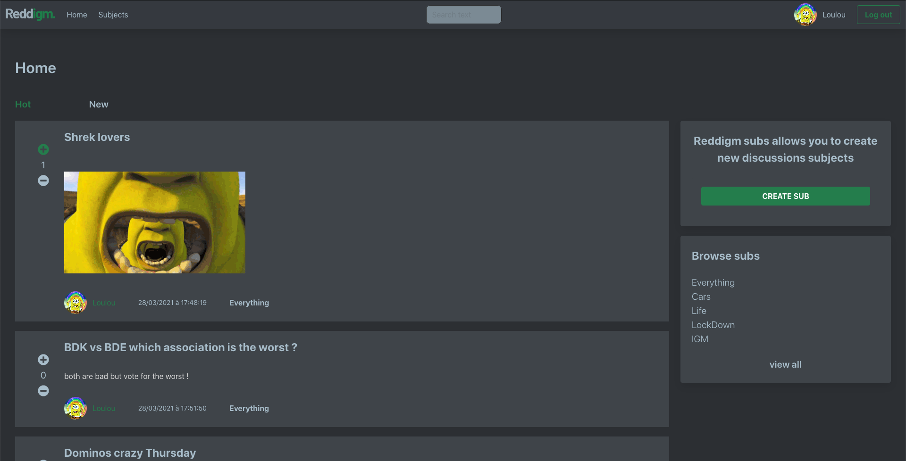
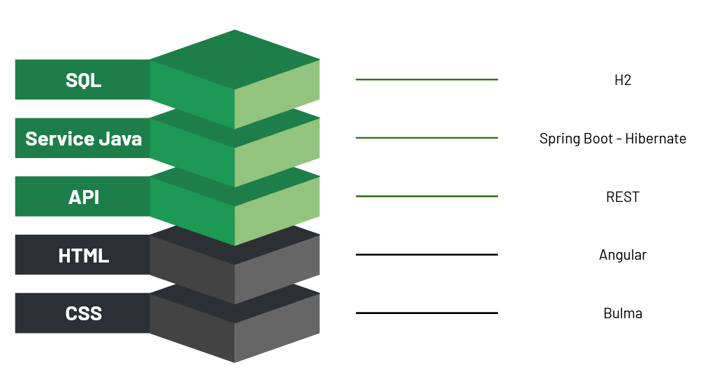

<p align="center">
    
    <p align="center">Reddigm is the ✨best✨ network of communities.</p>
</p>

<details open="open">
  <summary>Table of Contents</summary>
  <ol>
    <li>
      <a href="#about-the-project">About The Project</a>
    </li>
    <li>
      <a href="#description">Description</a>
      <ul>
        <li><a href="#developed-with">Developed with</a></li>
        <li><a href="#architecture">Architecture</a></li>
      </ul>
    </li>
    <li>
      <a href="#getting-started">Getting Started</a>
      <ul>
        <li><a href="#requirements">Requirements</a></li>
        <li><a href="#clone-the-repository">Clone the Repository</a></li>
        <li><a href="#accounts-available">Accounts available</a></li>
        <li><a href="#running-the-back-end-application-locally">Running the Back-End application locally</a></li>
        <li><a href="#running-the-front-end-application-locally">Running the Front-End application locally</a></li>
        <li><a href="#use-application">Use application</a></li>
      </ul>
    </li>
    <li>
      <a href="#developers">Developers</a>
    </li>
    <li>
      <a href="#acknowledgments">Acknowledgments</a>
    </li>
  </ol>
</details>

## About the project
Reddigm is the ✨best✨ network of communities based on people's interests. Find communities you're interested in, and become part of an online community!
The original idea of ​​this project is totally innovative and is absolutely not inspired by a [famous network of communities](https://www.reddit.com/) with an orange logo.
This project was developed during the last year of software master's degree at IGM.

## Description
<p align="center">
    
</p>
Reddigm allows users to create subjects and posts about a specific topic.
Users can also comment or vote on these posts or other comments.
The site offers them the possibility of personalizing their profile.

### Developed with
* [Java](https://docs.oracle.com/en/java/javase/13/docs/api/index.html)
* [Spring-Boot](https://spring.io/projects/spring-boot)
* [Angular](https://angular.io/)

### Architecture
This application follows a REST architecture, here is the technical stack used for this project :

<p align="center">
    
</p>

## Getting Started

### Requirements
For building and running the application you need, for Back-End application:

* [JDK 1.13](https://www.oracle.com/java/technologies/javase/jdk13-archive-downloads.html)
* [Maven 3](https://maven.apache.org/)
* [Angular](https://angular.io/)

### Clone the Repository
As usual, you get started by cloning the project to your local machine:
```
git clone https://gitlab.com/jee-2020-2021-apprentis/groupe-c.git
```

### Accounts available
* Pseudo = ElTiernausore : Password = Thierno (USER)
* Pseudo = LouisBinaire : Password = Yvette (USER)
* Pseudo = admin : Password = admin (ADMIN)


### Running the Back-End application locally
There are several ways to run a Spring Boot application on your local machine. One way is to execute the `main` method in the `src/main/java/fr/uge/jee/web/service/reddIGM` ReddIgmApplication class from your IDE.

### Running the Front-End application locally
The easiest way to run the Front-End application is to run `ng serve` command in the `src/main/webapp/ReddIGM-Front` folder.

### Use application
You can then go on website which is available locally at: `http://localhost:4200/home`

## Developers
* [BANGOURA Thierno](tbangour@guestviews.co)
* [BESNARD Pierre-Jean](https://gitlab.com/PJBesnard)
* [BILLAUT Louis](https://gitlab.com/BILLAUT_Louis)
* [WADAN Samy](https://gitlab.com/SaladeTomateOignon)

## Acknowledgments

Inspiration.
* [Reddit](https://www.reddit.com/)
